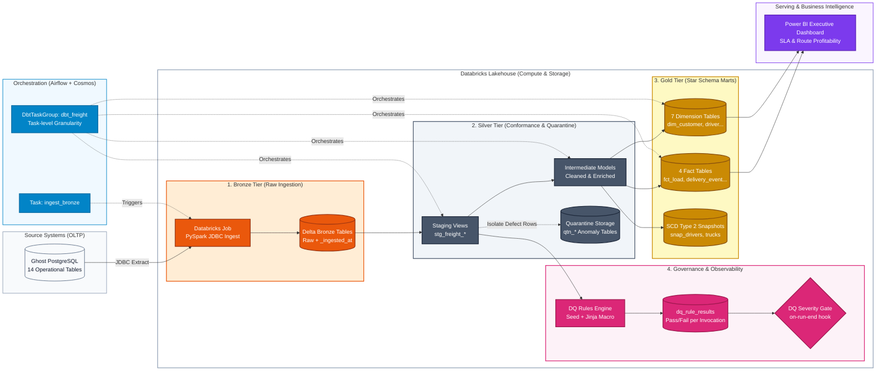
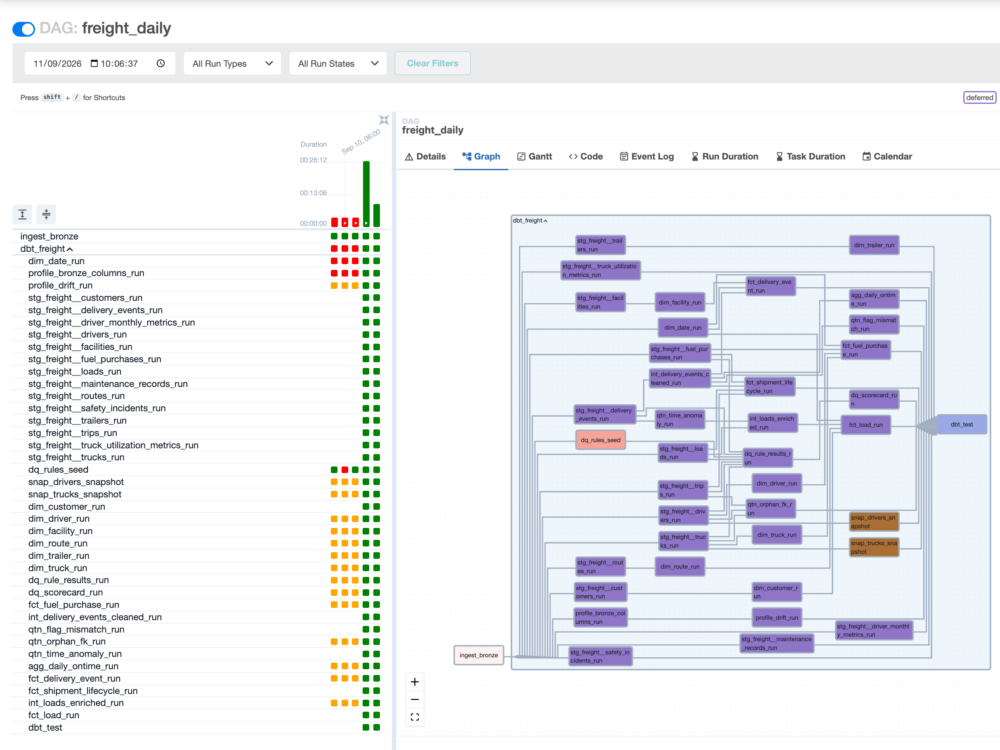

# Freight Data Platform: Medallion Architecture & Data Governance

A production-grade Freight Analytics Warehouse built on **Databricks Lakehouse (Delta Lake)** and **dbt Core**, orchestrated via **Apache Airflow (Astronomer Cosmos)**. 

The platform implements an end-to-end data pipeline processing **85,410 shipments over 3 years** across 14 relational tables, featuring strict **Environment Isolation**, **Medallion Architecture**, and a **Metadata-Driven Data Quality Engine**.

---

## 1. Architectural Big Picture: The Medallion Paradigm vs. Environments

A frequent pitfall in data engineering projects is blurring the line between **Data Processing Stages (Medallion Layers)** and **Infrastructure Environments (Catalogs)**. In this platform, these two dimensions are strictly decoupled.

```
+-------------------------------------------------------------------------------------------------------+
|                                    ENVIRONMENT ISOLATION (CATALOGS)                                   |
|                                                                                                       |
|  [ freight_dev ]                     [ freight_ci ]                      [ freight_prod ]             |
|  Local development & feature testing Ephemeral PR checks (GitHub Actions) Automated Airflow execution|
|                                                                          Only source read by BI       |
+-------------------------------------------------------------------------------------------------------+
                                                   |
                                                   v
+-------------------------------------------------------------------------------------------------------+
|                                       MEDALLION DATA TIERS (SCHEMAS)                                  |
|                                                                                                       |
|  1. BRONZE (bronze.*)       --> Raw ingestion from OLTP via Spark JDBC. 1:1 schema, append-only,     |
|                                 watermarked, zero transformations.                                    |
|                                                                                                       |
|  2. SILVER (staging.*,      --> Cleaned & conformist views/tables. Data type casting, ISO timestamp   |
|     intermediate.*)             enrichment, surrogate key hashing, and quarantine isolation of        |
|                                 operational anomalies.                                                |
|                                                                                                       |
|  3. GOLD (marts.*)          --> Kimball Dimensional Modeling. 7 Dimensions, 4 Facts, SCD Type 2       |
|                                 snapshots, enforce strict contracts, and Power BI exposures.          |
|                                                                                                       |
|  4. OBSERVABILITY           --> Metadata-driven Data Quality engine, table profiling metrics,         |
|     (observability.*)           and execution run histories.                                          |
+-------------------------------------------------------------------------------------------------------+
```

---

## 2. Environment Isolation Matrix (Three-Level Namespace)

Databricks Unity Catalog provides a 3-level namespace: `<catalog>.<schema>.<table>`. This platform leverages catalogs for **complete multi-environment isolation**:

| Catalog | Target Persona / Engine | Ingestion Mode | Data Quality & Lifecycle |
| :--- | :--- | :--- | :--- |
| **`freight_dev`** | Data / Analytics Engineers (Local CLI) | Manual / On-demand Spark Job | Disposable scratchpad. Developers can freely `DROP SCHEMA` or test partial dbt runs without impacting downstream consumers. |
| **`freight_ci`** | GitHub Actions CI/CD Runners | Automated fixture seeding | Ephemeral validation sandbox. Every Pull Request triggers Slim CI (`state:modified+`) into isolated schemas, preventing cross-PR data pollution. |
| **`freight_prod`** | Apache Airflow Scheduler (`0 6 * * *`) | Automated daily incremental | **Immutable single source of truth**. No human developer has write access (`dbt build` is forbidden from local). Only BI consumers (`bi_reader`) are granted query access. |

---

## 3. Detailed Data Pipeline Flow: From Ingestion to Consumption



### Medallion Layer Specifications

#### 🟢 Bronze: High-Watermark Raw Ingestion
- **Engine:** PySpark running inside a Databricks Job task (`databricks/nb_ingest_bronze.py`).
- **Strategy:** 
  - Dimension-like small tables (e.g., `customers`, `facilities`, `routes`): **Full-refresh Overwrite**.
  - High-volume transaction tables (`loads`, `trips`, `fuel_purchases`): **Incremental Append** based on table-specific high-watermark timestamps (e.g., `load_date > MAX(load_date)`).
- **Metadata Tagging:** Every record is enriched with ingestion lineage metadata: `_ingested_at` (UTC timestamp) and `_source_file` (`ghost_postgres.oltp.<table>`).

#### ⚪ Silver: Conformance & Quarantine Pattern
- **Staging (`models/staging/`):** Renames source columns to standard snake_case, handles timestamp formatting, and documents base schemas.
- **Data Cleansing & Enrichment (`models/intermediate/`):** Implements business business logic (recomputing actual shipment transit duration, detecting weather or traffic delays).
- **Quarantine Layer (`models/intermediate/quarantine/`):** Instead of silently discarding or filtering invalid records, defect rows (e.g., negative transit times, orphan customer foreign keys) are routed to dedicated `qtn_*` tables for data engineering auditing.

#### 🟡 Gold: Dimensional Modeling (Kimball Architecture)
- **Dimensions (`models/marts/dimensions/`):** Formats 7 conforming dimensions. Implements **Slowly Changing Dimensions (SCD Type 2)** via dbt snapshots (`snap_drivers_snapshot`, `snap_trucks_snapshot`) tracking driver equipment assignments and status history over time.
- **Facts (`models/marts/facts/`):**
  - `fct_load`: Shipment transaction fact with strict **dbt model contracts** enforced.
  - `fct_delivery_event`: High-throughput microbatch incremental model recording milestone events (Pickup, Delivery).
  - `fct_shipment_lifecycle`: Accumulated snapshot fact tracing full dispatch-to-delivery lifecycle duration.

#### 🟣 Observability: Metadata-Driven Quality Control
- **DQ Engine (`macros/dq/build_dq_sql.sql`):** Reads validation thresholds defined in `seeds/dq_rules.csv` and compiles automated multi-table assertion SQL.
- **Severity Gate (`macros/dq/dq_severity_gate.sql`):** Integrated into the dbt `on-run-end` lifecycle. Evaluates failure counts of `error`-level assertions and aborts the pipeline run before downstream consumption can proceed.

---

## 4. Orchestration: Apache Airflow & Astronomer Cosmos

Instead of treating dbt as a black-box `BashOperator("dbt build")`, this platform utilizes **Astronomer Cosmos** (`cosmos.DbtTaskGroup`):
- **Task-level Granularity:** Parses `manifest.json` to dynamically generate individual Airflow tasks for every dbt model, seed, test, and snapshot.
- **Isolated Virtual Environments:** Resolves dependency conflicts between Airflow (2.10) and dbt (1.12) by containerizing dbt inside a dedicated virtual environment (`/home/airflow/dbt_venv`).
- **Idempotency Verification:** Includes a dedicated DAG (`freight_backfill`) targeting microbatch models to prove pipeline determinism across re-runs.

### Pipeline Execution Showcase


*Figure: Production execution state in Apache Airflow (Astronomer Cosmos). Left: 100% Green Grid run status across Ingestion, Staging, and Marts. Right: Dynamic DAG dependency graph.*

---
